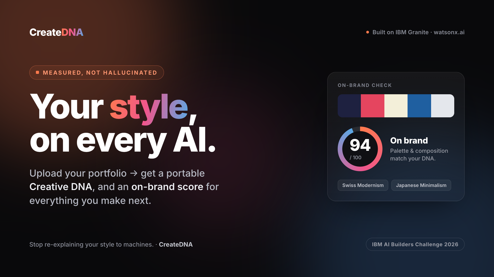
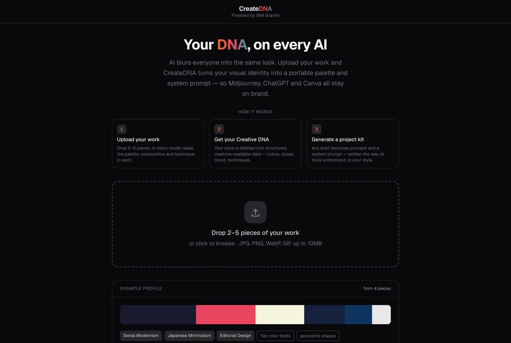
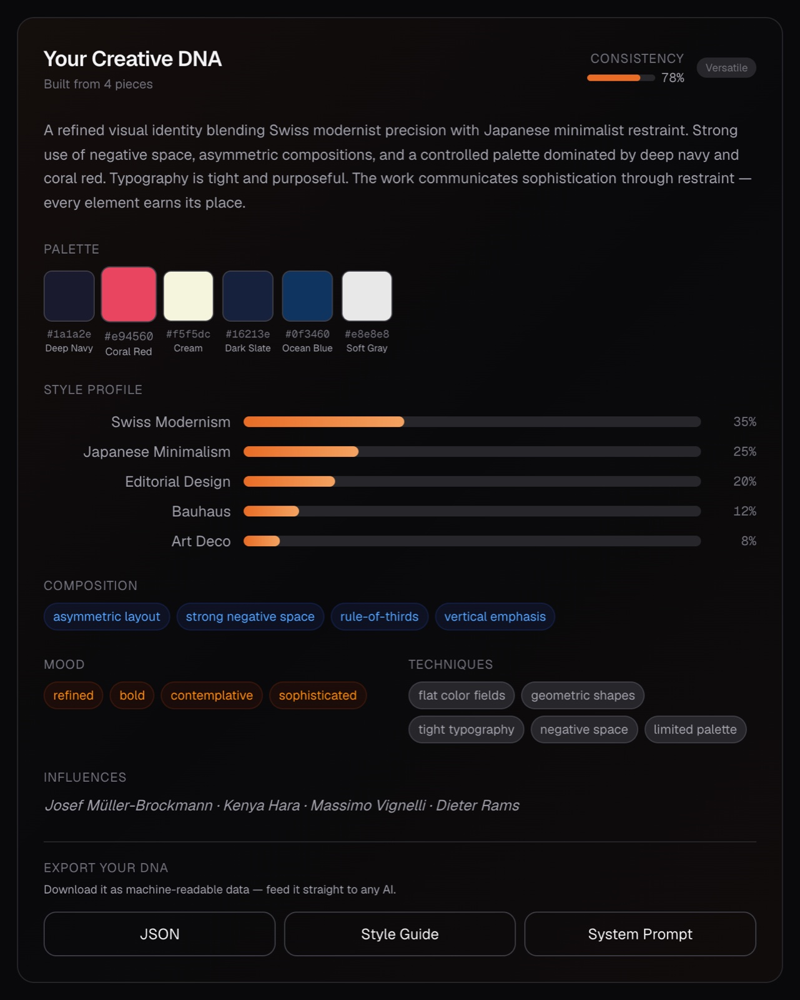
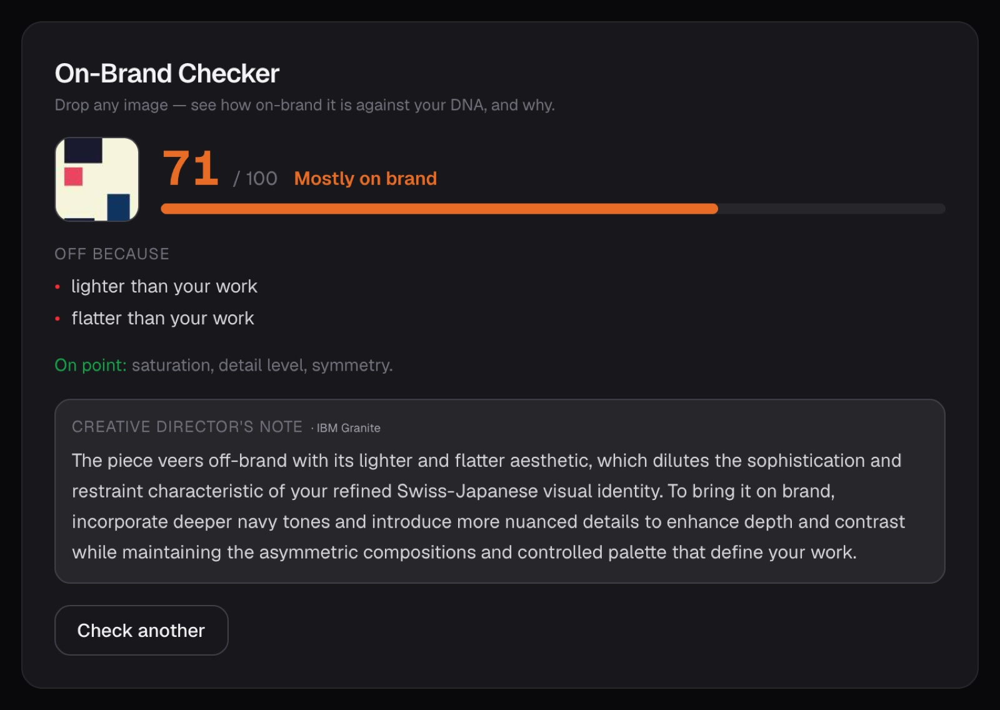
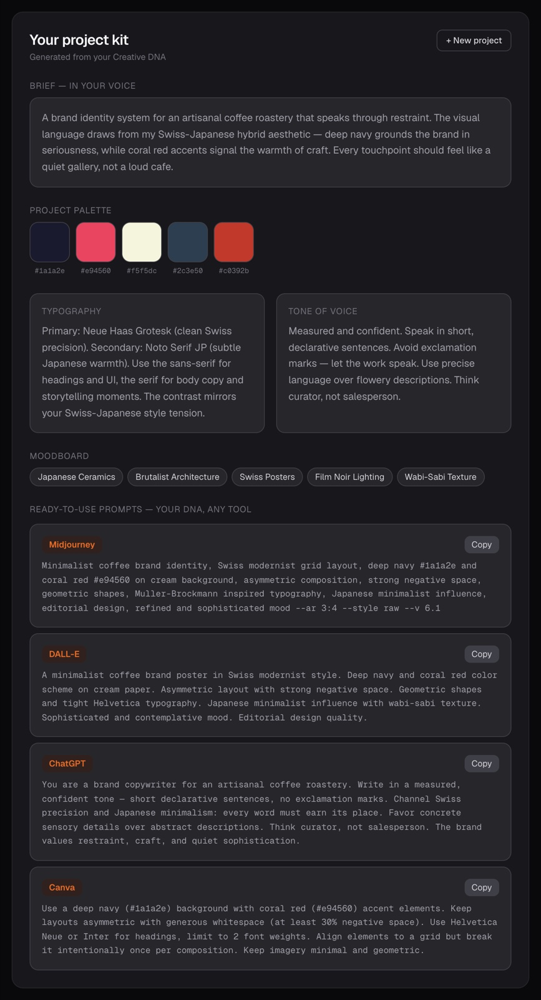

<div align="center">



# CreateDNA

### **AI that knows your style.**

Upload your portfolio → watsonx.ai learns your **Creative DNA** → IBM Granite generates every new project pre-loaded with your aesthetic — and scores new work against it.

<br>

[](https://www.ibm.com/products/watsonx-ai)
[](https://www.ibm.com/granite)
[](https://www.ibm.com/products/watsonx-ai)


</div>

---

> ### 🏆 Built for the IBM AI Builders Challenge 2026
>
> **July theme — *Reimagine Creative Industries with AI*.**
> CreateDNA was designed, built and shipped for this challenge: a personalized creative
> assistant powered by **IBM Granite** and **watsonx.ai** vision, wrapped around a
> deterministic, tested core. Development was done primarily with **IBM Bob**, IBM's
> AI development assistant — see [How IBM Bob Was Used](#how-ibm-bob-was-used).
>
> No API keys? Hit **See a demo** in the app — judges get the full experience instantly.

---

## Table of Contents

- [Screenshots](#screenshots)
- [The Problem](#the-problem)
- [The Solution](#the-solution)
- [Key Features](#key-features)
- [How It Works](#how-it-works)
- [The AI Architecture](#the-ai-architecture--measured-not-hallucinated)
- [How IBM Bob Was Used](#how-ibm-bob-was-used)
- [Tech Stack](#tech-stack)
- [Getting Started](#getting-started)
- [API Reference](#api-reference)
- [Model IDs](#model-ids)
- [Project Structure](#project-structure)
- [Engineering Decisions](#engineering-decisions)
- [Testing](#testing)
- [Demo Mode](#demo-mode)
- [Challenge Fit](#challenge-fit)
- [License](#license)

---

## Screenshots

### 1 · Landing — upload 2–5 pieces of your work



### 2 · Your Creative DNA — pixel-true palette, measured style profile, one-click export



### 3 · On-Brand Checker — a reproducible 0–100 score, plus a Granite director's note



> The score, the *"off because"* reasons and the *"on point"* list are **computed from pixels** —
> IBM Granite only writes the note, and is forbidden from contradicting the measured signals.

### 4 · Project kit — palette, typography, tone and ready-to-paste prompts for every AI tool



---

## The Problem

Creative professionals face a fragmented AI landscape:

- **AI tools don't know who you are.** Every time you open Midjourney, ChatGPT, or Canva, you start from zero — describing your style from scratch.
- **Inconsistent output.** Without a persistent identity, AI-generated work drifts away from your aesthetic — every session starts from the model's defaults, not yours.
- **Tool fatigue.** The average creative professional uses 7+ AI tools. Each requires re-explaining your palette, tone, and visual language.
- **No way to check consistency.** When you *do* produce new work, there's no objective way to ask "is this still on-brand for me?"

Your creative identity shouldn't reset every time you switch tools.

## The Solution

CreateDNA extracts your visual identity from your portfolio, makes it **portable** across every AI tool, and lets you **measure** new work against it:

| | Step | What happens |
|:--:|---|---|
| **1** | **Upload** | Drop your portfolio images — designs, posters, logos, photos |
| **2** | **Analyze** | A deterministic reading engine measures palette, composition, mood, technique and style movement directly from pixels; watsonx.ai vision adds semantic interpretation |
| **3** | **Accumulate** | Each upload merges into a growing DNA profile. The more you upload, the sharper it knows you |
| **4** | **Generate** | Enter a brief → IBM Granite returns palette, typography, tone and ready-to-paste prompts for Midjourney, DALL·E, ChatGPT and Canva — all in *your* style |
| **5** | **Check** | Drop in any new image and get a reproducible 0–100 on-brand score plus a grounded creative-director's note from IBM Granite |
| **6** | **Export** | Download your Creative DNA as JSON, Markdown or a portable system prompt. One paste and any AI knows your style |

## Key Features

| Feature | What it does |
|---|---|
| **Portfolio upload** | Drag-drop or click, multi-file, type/size validation, retry on failure, client-side downscale to 1024px (~84% smaller payloads) |
| **Pixel-true palette** | Dominant colours sampled from real canvas pixels — never guessed by a model — and named from actual hue |
| **Deterministic reading engine** | Pure functions turn RGBA pixels into measured mood, technique, composition, colour harmony, and style movements — the *same image always reads the same way* |
| **Vision analysis** | watsonx.ai (Llama 4 Maverick) adds semantic interpretation, snapped to the deterministic arbiter so it can't hallucinate the palette |
| **Weighted DNA merge** | New analyses merge into the profile with colour-proximity detection and proportional style blending; a consistency score is derived from style-weight entropy |
| **Project kit generation** | IBM Granite receives the full DNA as context and returns palette extensions, typography pairings, tone-of-voice guides, and tool-specific prompts |
| **On-Brand Checker** | Score any new image 0–100 against your DNA (reproducible, pixel-derived) with a Granite-written director's note grounded in the measured signals |
| **Export** | JSON, Markdown style guide, or portable system prompt — usable in any AI tool |
| **Demo mode** | One-click sample profile so judges without API keys see the full experience |
| **Production polish** | Dark mode, mobile responsive, `prefers-reduced-motion`, full keyboard operation, versioned persisted state with a recovery screen |

## How It Works

```
                         ┌─ Deterministic reading engine (pixels → measured facts)
Portfolio Images ────────┤
                         └─ watsonx.ai Vision (Llama 4 Maverick, semantic layer)
                                        │
                                        ▼
                             Style DNA Profile  ◄── weighted merge (accumulates)
                                        │
                 ┌──────────────────────┼──────────────────────┐
                 ▼                      ▼                       ▼
        Project Brief          New image to check         Export
                 │                      │                       │
     IBM Granite (kit)        Deterministic score        JSON / Markdown /
                 │            + Granite director's note   System Prompt
                 ▼                      ▼                       ▼
   Palette · Type · Tone     0–100 on-brand verdict      → paste into any AI tool
   · Midjourney/DALL·E/…
```

## The AI Architecture — *measured, not hallucinated*

The core design principle: **vision models guess, pixels don't.** A model asked for a hex palette invents plausible colours from impression; asked for "mood" it free-associates. CreateDNA inverts this — it *measures* what it can and uses the models only where language is genuinely needed.

**1. Deterministic reading engine** (`src/lib/analysis/`)
Pure, model-free functions read the raw canvas pixels:
- `image-features.ts` — a pure function of RGBA → warmth, chroma, luminance, contrast, bilateral symmetry, negative space, edge density, orientation, aspect. Same pixels → same numbers, always.
- `descriptors.ts` — maps those features to human mood / technique / composition words through **fixed bands**. This replaces the vision model's guessed mood/technique.
- `taxonomy.ts` — scores a fixed, closed set of design movements and returns the best matches with weights — the authoritative, reproducible source of style labels.

**2. Vision model — semantic layer** (`meta-llama/llama-4-maverick-17b-128e-instruct-fp8`)
watsonx.ai's multimodal endpoint interprets *what* the image is about. Its output is **snapped to the deterministic arbiter** where measured signals exist, so the palette and core reading stay pixel-true while the model contributes the semantic richness a pure function can't.

**3. IBM Granite — the writer** (`ibm/granite-4-h-small`)
Granite never invents verdicts. It receives the full DNA profile (for project kits) or the *measured* on-brand score and reasons (for the checker) and does the one thing models are great at: phrasing. The On-Brand Checker computes the score from pixels, then Granite writes a one-to-two-sentence creative-director's note at low temperature (0.3), grounded in — and forbidden from contradicting — those signals.

**4. IAM authentication** (`src/lib/granite.ts`)
An IBM Cloud API key is exchanged for a Bearer token via IAM token exchange, cached for 55 minutes (IBM tokens expire after 60). Every AI call routes through this single client — components never touch watsonx directly. Transport is native `fetch` against watsonx's `/ml/v1/text/chat` endpoint, with `project_id` in the request body.

The payoff: the parts of your Creative DNA that *should* be objective (colour, contrast, composition, on-brand score) are **reproducible**, and the parts that benefit from language (interpretation, advice, kit copy) come from IBM's models — with no room to hallucinate the facts.

## How IBM Bob Was Used

CreateDNA was built primarily with **IBM Bob**, IBM's AI-powered development assistant, running in VS Code — it was the main development tool throughout the project, used across its modes:

- **Ask** — to explore Next.js 16's App Router conventions and the watsonx.ai `/ml/v1/text/chat` API before writing code.
- **Plan** — to design the architecture: the weighted Style-DNA merge algorithm and the upload → DNA → brief → kit workflow.
- **Code** — to implement the React components, the `/api/analyze`, `/api/generate`, `/api/check`, and `/api/export` routes, the Zustand store, and the watsonx IAM auth client in `src/lib/granite.ts`.

Bob handled the bulk of the implementation and debugging across the codebase.

## Tech Stack

| Layer | Choice |
|---|---|
| Framework | Next.js 16 (App Router, TypeScript) |
| Styling | Tailwind CSS v4 |
| State | Zustand 5 with localStorage persistence |
| Animations | Framer Motion 12 |
| Text AI | IBM Granite 4 H Small (`ibm/granite-4-h-small`) |
| Vision AI | Llama 4 Maverick (`meta-llama/llama-4-maverick-17b-128e-instruct-fp8`) |
| AI Transport | watsonx.ai `/ml/v1/text/chat` REST API via native `fetch` |
| Testing | Vitest (35 tests across the deterministic core) |

## Getting Started

### 1. Clone and install

```bash
git clone https://github.com/ssaaffaakk/CreateDNA.git
cd CreateDNA
npm install
```

### 2. Configure environment variables

Create `.env.local` in the project root:

```env
# IBM Cloud IAM API key — https://cloud.ibm.com/iam/apikeys
WATSONX_API_KEY=your_api_key_here

# watsonx.ai project ID — find in your project settings
WATSONX_PROJECT_ID=your_project_id_here

# watsonx.ai regional endpoint (must match your WML service region)
WATSONX_URL=https://eu-de.ml.cloud.ibm.com
```

> **Note:** Your WML (Watson Machine Learning) service instance must be **associated with your watsonx.ai project**, and both must live in the same region as `WATSONX_URL`. Available Granite models differ per region and plan — the Lite plan does not offer every model. No keys? Use the **See a demo** button (see [Demo Mode](#demo-mode)).

### 3. Run

```bash
npm run dev        # start the dev server → http://localhost:3000
npm run build      # production build
npm test           # run the Vitest suite
npm run lint       # eslint
```

## API Reference

| Route | Method | Description |
|---|---|---|
| `/api/analyze` | POST | Accepts `{ imageBase64, sampledPalette, existingDNA }`, runs vision + merge, returns updated `StyleDNA` |
| `/api/generate` | POST | Accepts `{ styleDNA, brief }`, returns a full project kit |
| `/api/check` | POST | Accepts the measured `{ score, verdict, reasons, matches, dnaSummary }`, returns a grounded Granite director's note |
| `/api/export` | POST | Accepts `{ styleDNA, format }`, returns JSON / Markdown / system-prompt content |

All routes enforce a body-size limit and clamp string lengths server-side ([`request-guard.ts`](src/lib/request-guard.ts)), and map upstream failures to safe client messages ([`api-error.ts`](src/lib/api-error.ts)).

## Model IDs

| Model | ID | Usage |
|---|---|---|
| Text | `ibm/granite-4-h-small` | Project-kit generation · on-brand director's note |
| Vision | `meta-llama/llama-4-maverick-17b-128e-instruct-fp8` | Image analysis → semantic style layer |

Both run on **IBM watsonx.ai**. Model IDs live only as constants (`TEXT_MODEL`, `VISION_MODEL`) at the top of [`src/lib/granite.ts`](src/lib/granite.ts) — never hardcoded in a route or component.

## Project Structure

```
src/
├── app/
│   ├── page.tsx              # Single-page UI — landing, upload, DNA, kit, checker
│   ├── layout.tsx            # Root layout, metadata, OpenGraph
│   ├── global-error.tsx      # Recovery screen with a "Clear saved data" escape hatch
│   ├── globals.css           # Tailwind v4, accent + cool tokens, reduced motion
│   └── api/
│       ├── analyze/route.ts  # Vision + mergeStyleDNA
│       ├── generate/route.ts # Granite → project kit
│       ├── check/route.ts    # Granite → grounded on-brand director's note
│       └── export/route.ts   # JSON / Markdown / system-prompt
├── components/
│   ├── UploadZone.tsx        # Drag-drop upload, pixel palette sampling, thumbnails
│   ├── StyleDNAPanel.tsx     # Merged DNA display + export
│   ├── ProjectBriefForm.tsx  # Brief input → /api/generate
│   ├── OutputPanel.tsx       # Project kit: palette, type/tone, moodboard, prompts
│   └── BrandChecker.tsx      # On-Brand Checker: drop an image, get a scored verdict
└── lib/
    ├── granite.ts            # IAM token cache + fetch-based watsonx chat client
    ├── store.ts              # Zustand store + persisted-schema version/migrate
    ├── style-dna.ts          # StyleDNA types, ANALYSIS_PROMPT, mergeStyleDNA
    ├── palette.ts            # Real pixel-colour extraction + hue-based naming
    ├── export-dna.ts         # Shared DNA export (JSON / Markdown / prompt)
    ├── api-error.ts          # Upstream errors → safe client messages
    ├── request-guard.ts      # Body-size rejection + prompt clamping
    ├── mock-data.ts          # Demo-mode sample data
    └── analysis/             # Deterministic reading engine (model-free)
        ├── image-features.ts # RGBA pixels → measured features (pure)
        ├── descriptors.ts    # features → mood / technique / composition
        ├── taxonomy.ts       # features → design-movement classification
        └── on-brand.ts       # image signature vs DNA → reproducible 0–100 score
```

## Engineering Decisions

- **Colour accuracy from pixels, not impression.** Vision models guess hex codes from vibe. `UploadZone` samples the true dominant colours from the canvas (`extractDominantColors`) and sends them to `/api/analyze`, which names each from the real hue — the model supplies only composition/mood/techniques.
- **A deterministic core the models orbit.** Mood, technique, composition, style movement, and the on-brand score are all pure functions of pixels (`src/lib/analysis/`). Reproducibility is a feature: the same image reads the same way every time, and the models are constrained to phrase — never to invent — the facts.
- **`localStorage` is untrusted input.** Everything read from persistence passes through `sanitizePersisted` before reaching a component; `PERSIST_VERSION` gates a `migrate` for any breaking shape change. Transient UI state (`isAnalyzing`, `error`) is deliberately excluded from persistence.
- **Motion never blocks content.** Product content renders with `initial={false}`; a backgrounded tab pauses `requestAnimationFrame`, and gating a render on an exit animation would strand the workflow — so the brief↔kit swap is a plain conditional render, not `AnimatePresence mode="wait"`.
- **Demo mode never pollutes real work.** The example profile carries a fixed id; the first real upload starts a fresh profile instead of merging real work into demo fiction.

## Testing

```bash
npm test
```

35 Vitest tests cover the deterministic core — the parts that *must* be reproducible:

- `style-dna.test.ts` — merge algorithm, colour proximity, weight clamping
- `palette.test.ts` — pixel extraction and hue-based colour naming
- `analysis/image-features.test.ts` — measured features are stable and in-range
- `analysis/reading.test.ts` — features → descriptors → movements pipeline
- `analysis/on-brand.test.ts` — on-brand scoring is reproducible and bounded

## Demo Mode

For hackathon judges without API credentials, the app ships a **See a demo** button that loads a pre-built sample profile (a Swiss-Japanese minimalist creator) with a full DNA, a generated project kit, and a working On-Brand Checker. The generate step is mocked in demo mode so keyless judges see a real kit instead of an auth error — while the first real upload cleanly exits demo mode into a fresh profile.

## Challenge Fit

CreateDNA is a submission for the **IBM AI Builders Challenge 2026**, July theme *Reimagine Creative Industries with AI*.

- **Challenge fit** — a personalized creative assistant / AI creative partner that gives creators a persistent, portable identity across the fragmented AI-tool landscape.
- **Technical execution** — a two-model watsonx.ai pipeline (Granite text + Llama 4 Maverick vision) wrapped around a deterministic, tested core, with IAM auth, server-side validation, and a versioned persistence layer.
- **Innovation** — the *measured, not hallucinated* architecture: models are used for language, pixels for facts, so the objective parts of a creator's DNA are reproducible.
- **Real-world impact** — cuts the "re-explain my style to every tool" tax, and adds an objective on-brand check that no single-prompt tool offers.

## License

MIT — see [LICENSE](LICENSE).

<div align="center">
<br>

**Built with IBM Granite on watsonx.ai · IBM AI Builders Challenge 2026**

</div>
